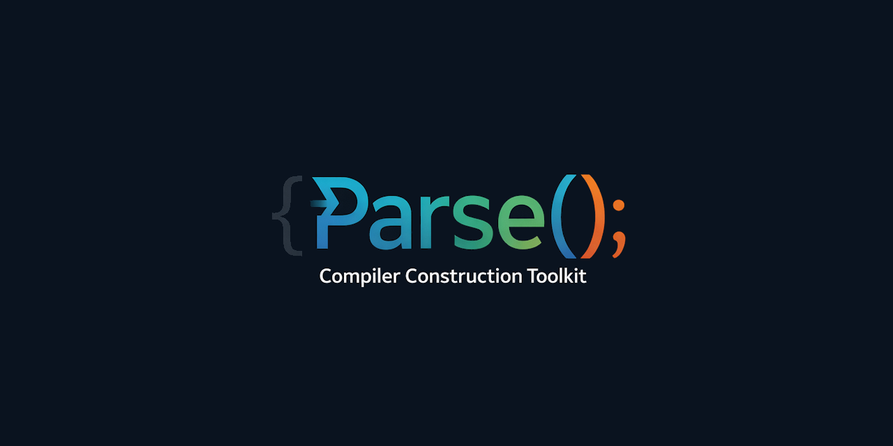

<div align="center">



[](https://discord.gg/Wb6z8Wam7p) [](https://bsky.app/profile/tinybiggames.com)

</div>

## What is Parse()?

**Parse() is a compiler construction toolkit. You define the language. It handles the rest.**

Parse() is a Delphi library that gives you a complete, configurable compilation pipeline in a single fluent API. You describe your language: its keywords, operators, grammar rules, and code generation, through one configuration object. Parse() runs that description through a full source-to-binary toolchain: tokenizer, Pratt parser, semantic engine, C++23 emitter, and Zig-based native compiler.

```pascal
// This is your entire language definition.
// One config object. One Compile() call. One native binary.

LParse.Config()
  .AddKeyword('print', 'keyword.print')
  .AddOperator('(', 'delimiter.lparen')
  .AddOperator(')', 'delimiter.rparen')
  .AddStringStyle('"', '"', PARSE_KIND_STRING, True);

LParse.Config().RegisterStatement('keyword.print', 'stmt.print',
  function(AParser: TParseParserBase): TParseASTNodeBase
  var
    LNode: TParseASTNode;
  begin
    LNode := AParser.CreateNode();
    AParser.Consume();
    AParser.Expect('delimiter.lparen');
    LNode.AddChild(TParseASTNode(AParser.ParseExpression(0)));
    AParser.Expect('delimiter.rparen');
    Result := LNode;
  end);

LParse.Config().RegisterEmitter('stmt.print',
  procedure(ANode: TParseASTNodeBase; AGen: TParseIRBase)
  begin
    AGen.Stmt('std::cout << ' +
      LParse.Config().ExprToString(ANode.GetChild(0)) + ' << std::endl;');
  end);

LParse.SetSourceFile('hello.mylang');
LParse.Compile();
```

The target is always C++ 23, compiled to a native binary via Zig/Clang. You never write C++ and you never configure a build system. Parse() generates, compiles, and optionally executes the result in a single call.

## 🎯 Who is Parse() For?

Parse() is for developers who want to build a programming language without spending six months on infrastructure. If any of the following describes you, Parse() is worth a look:

- **Language designers**: You have a syntax idea and want to see it run as a native binary this week, not next year. Parse() handles every stage from source text to executable. You focus on the language design.
- **Domain-specific language authors**: Build a DSL for configuration, scripting, query, or automation that compiles to native code rather than being interpreted. No external runtime, no JVM, no Python dependency.
- **Compiler students and researchers**: Learn real compiler construction techniques: Pratt parsing, scope analysis, AST enrichment, code generation, through working implementations, not textbook pseudocode.
- **Tool builders**: Build code generators, transpilers, or custom build pipelines around a language you define. Parse() fits naturally into developer tooling and build-time workflows.
- **Language porters**: Bring an existing language syntax to native compilation by writing the grammar and emit handlers. The hard parts: parsing theory, optimization, linking, are all handled.

## ✨ Key Features

- 🔧 **One config, one language**: A single `TParse` object drives every stage of the pipeline. Define keywords, operators, grammar rules, and emitters in one place. The lexer, parser, semantic engine, and codegen all read from the same config.
- ⚡ **Pratt parser built in**: Top-down operator precedence parsing ships ready to use. Register prefix, infix-left, infix-right, and statement handlers. Binding powers control precedence. No grammar files, no parser generators.
- 🌳 **Generic AST with attribute store**: Every AST node carries a string-keyed attribute dictionary. Parse stages communicate through attributes. The semantic engine writes `PARSE_ATTR_*` values that the codegen reads. No coupling between stages.
- 🔬 **Semantic engine with scope trees**: Built-in symbol table, scope push/pop, symbol declaration and lookup, type compatibility checking, and implicit coercion annotation. Register only the handlers you need; unregistered node kinds are walked transparently.
- 🎯 **C++23 fluent emitter**: A structured IR builder generates well-formed C++ 23 text. Functions, parameters, variables, control flow, expressions: all through a fluent API. No string-formatting C++ by hand.
- 🏗️ **Dual-file output**: Generates `.h` (forward declarations, type aliases, constants) and `.cpp` (implementations) automatically. Language authors direct output to header or source per statement.
- 🚀 **Zig as the build backend**: The generated C++ is compiled to a native binary by Zig/Clang with no external toolchain setup required. Target Windows x64 or Linux x64. Build modes: exe, lib, dll. Optimize levels: debug, release-safe, release-fast, release-small.
- 🔄 **Type inference surface**: Built-in literal-type mapping and call-site scanning for dynamically-typed languages. Infer variable types from initialisers without explicit type annotations.
- 🗂️ **TOML config persistence**: Language configurations can be serialized to and loaded from TOML files. Snapshot a language definition and reload it without recompiling the Delphi host.
- 📡 **LSP-ready enriched AST**: After semantic analysis the AST is self-sufficient. Every node carries resolved type, symbol, scope, and storage attributes. An LSP layer can query `FindNodeAt`, `GetSymbolsInScopeAt`, and `FindSymbol` without re-running any stage.
- 🧩 **ExprToString with overrides**: Built-in recursive expression-to-C++ conversion handles all standard expression kinds. Register per-kind overrides for language-specific rendering (e.g. Pascal single-quoted strings to C++ double-quoted).
- 🏷️ **Name mangling and TypeToIR**: Register a name mangling function to transform source identifiers to valid C++ names. Register a TypeToIR function to map source type kinds to C++ type strings.

## 🌐 Four Languages, One Toolkit

Parse() ships with four showcase language implementations. Each proves a different point about what the toolkit can express. All four compile the same program: declare variables, define functions, loop, branch, output, to native binaries using identical pipeline machinery.

### Pascal

Classic structured Pascal. Case-insensitive keywords, `:=` assignment, `begin`/`end` blocks, typed variables, typed procedures and functions, `writeln` with multiple arguments. The `Result` return convention. Full C++23 forward declarations to `.h`.

```pascal
program HelloWorld;

var
  greeting: string;
  count: integer;

procedure PrintBanner(msg: string);
begin
  writeln('--- ', msg, ' ---');
end;

function Add(a: integer; b: integer): integer;
begin
  Result := a + b;
end;

begin
  greeting := 'Hello, World!';
  count := 5;
  PrintBanner(greeting);
  writeln('5 + 3 = ', Add(5, 3));
  for i := 1 to count do
    writeln('  Step ', i);
end.
```

### Lua

Dynamically typed. No type annotations anywhere. Literal-based type inference at declaration sites. Call-site pre-scan for parameter type inference. `local`/global scope. `function`/`end`, `if`/`then`/`else`/`end`, `for i = start, limit do`/`end`, `while`/`do`/`end`. `..` string concatenation. `print()` variadic output.

```lua
local greeting = "Hello, World!"
local count = 5

function PrintBanner(msg)
    print("--- " .. msg .. " ---")
end

function Add(a, b)
    return a + b
end

PrintBanner(greeting)
print("5 + 3 = " .. Add(5, 3))

for i = 1, count do
    print("  Step " .. i)
end
```

### BASIC

Implicit program body, no header keyword required. `Dim`/`As` typed variable declarations. `Sub`/`End Sub` and `Function`/`End Function`. The `=` operator does dual duty: assignment at statement level, equality in expressions. `&` string concatenation. `If`/`Then`/`Else`/`End If`. `For`/`To`/`Next`. `While`/`Wend`. `Print` variadic output.

```basic
Dim greeting As String
Dim count As Integer

Sub PrintBanner(msg As String)
    Print "--- " & msg & " ---"
End Sub

Function Add(a As Integer, b As Integer) As Integer
    Add = a + b
End Function

greeting = "Hello, World!"
count = 5
PrintBanner(greeting)
Print "5 + 3 = " & Add(5, 3)

For i = 1 To count
    Print "  Step " & i
Next i
```

### Scheme

S-expression syntax. A single `(` handler drives all parsing, with no infix operators registered, no block keywords, and no statement terminator. `(define var expr)`, `(define (f args) body)`, `(set! x expr)`, `(if cond then else)`, `(begin expr...)`, `(display expr)`, `(newline)`. Kebab-case identifier names are mangled to `snake_case` for C++. `#t`/`#f` boolean literals.

```scheme
(define greeting "Hello, World!")
(define count 5)

(define (print-banner msg)
  (display "--- ")
  (display msg)
  (display " ---")
  (newline))

(define (add a b)
  (+ a b))

(print-banner greeting)
(display "5 + 3 = ")
(display (add 5 3))
(newline)
```

## 🔄 The Pipeline

Every language built on Parse() follows the same path:

```
Source Text
    │
    ▼
┌─────────┐  token stream   ┌─────────┐   AST        ┌───────────┐
│  Lexer  │ ──────────────► │ Parser  │ ───────────► │ Semantics │
└─────────┘                 └─────────┘              └───────────┘
                                                           │
                                               enriched AST (PARSE_ATTR_*)
                                                           │
                                                           ▼
                                                    ┌───────────┐
                                                    │  CodeGen  │ ──► .h + .cpp
                                                    └───────────┘          │
                                                                           ▼
                                                                      ┌──────────┐
                                                                      │   Zig    │ ──► native binary
                                                                      └──────────┘
```

A single `TParse` object drives every stage. There is no language knowledge hardcoded anywhere in the toolkit. The config is the language.

## 🚀 Getting Started

### Step 1: Download the Toolchain

**The toolchain must be downloaded separately from the source.** It contains the Zig compiler and C++ runtime that Parse() uses to compile generated code. Without it, the pipeline cannot produce binaries.

**[⬇️ Download parsekit-toolchain.zip](https://github.com/tinyBigGAMES/ParseKit/releases/download/toolchain-latest/parse-toolchain.zip)**

Unzip the toolchain directly into the root of your ParseKit source directory. The library requires the toolchain contents to be present at the repo root.

> **This is a permanent release entry.** The URL and filename will never change. When the toolchain is updated, the same release entry is replaced in place. You always download from the same link.

#### System Requirements

| | Requirement |
|---|---|
| **Host OS** | Windows 10/11 x64 |
| **Linux target** | WSL2 + Ubuntu (`wsl --install -d Ubuntu`) |
| **Delphi** | Delphi 11 Alexandria or later (to build from source) |

To cross-compile Linux x64 binaries from Windows, install WSL2 with Ubuntu. Parse() locates it automatically. There is nothing further to configure.

### Step 2: Get the Source

**Option 1: [Download ZIP](https://github.com/tinyBigGAMES/ParseKit/archive/refs/heads/main.zip)**

**Option 2: Git clone**
```bash
git clone https://github.com/tinyBigGAMES/ParseKit.git
```

### Step 3: Open in Delphi and Build

1. Open the project group in Delphi
2. Build the `Parse` project
3. Add `src\` to your project's search path or include it directly
4. `uses Parse;` is the only unit you need

### Step 4: Point at the Toolchain

Before calling `Compile()`, set the toolchain path so Parse() can locate Zig and the runtime:

```delphi
LParse.SetOutputPath('output');
LParse.SetTargetPlatform(tpWin64);
LParse.SetBuildMode(bmExe);
LParse.SetOptimizeLevel(olDebug);
```

### Step 5: Define Your Language and Compile

```delphi
var
  LParse: TParse;
begin
  LParse := TParse.Create();
  try
    // Configure your language on the lexer, grammar, and emit surfaces
    LParse.Config()
      .CaseSensitiveKeywords(False)
      .AddKeyword('print', 'keyword.print')
      .AddOperator('(', 'delimiter.lparen')
      .AddOperator(')', 'delimiter.rparen')
      .AddStringStyle('"', '"', PARSE_KIND_STRING, True)
      .SetStatementTerminator('');

    LParse.Config().RegisterLiteralPrefixes();

    LParse.Config().RegisterStatement('keyword.print', 'stmt.print',
      function(AParser: TParseParserBase): TParseASTNodeBase
      var
        LNode: TParseASTNode;
      begin
        LNode := AParser.CreateNode();
        AParser.Consume();
        AParser.Expect('delimiter.lparen');
        LNode.AddChild(TParseASTNode(AParser.ParseExpression(0)));
        AParser.Expect('delimiter.rparen');
        Result := LNode;
      end);

    LParse.Config().RegisterEmitter('stmt.print',
      procedure(ANode: TParseASTNodeBase; AGen: TParseIRBase)
      begin
        AGen.Include('iostream');
        AGen.Stmt('std::cout << ' +
          LParse.Config().ExprToString(ANode.GetChild(0)) + ' << std::endl;');
      end);

    LParse.SetSourceFile('hello.mylang');
    LParse.SetOutputPath('output');
    LParse.SetTargetPlatform(tpWin64);
    LParse.SetBuildMode(bmExe);
    LParse.SetOptimizeLevel(olDebug);

    LParse.SetStatusCallback(
      procedure(const ALine: string; const AUserData: Pointer)
      begin
        WriteLn(ALine);
      end);

    if LParse.Compile(True) then   // True = run the binary after compilation
      WriteLn('Done.')
    else
      WriteLn('Failed.');
  finally
    LParse.Free();
  end;
end;
```

## 📖 Documentation

| Document | Description |
|---|---|
| [Language Authoring Guide](docs/LANGUAGE-AUTHORING.md) | Complete walkthrough of the three configuration surfaces, the Pratt parser, AST building, semantic analysis, and the C++23 emitter. Includes worked examples and a full implementation checklist. |

## 🎯 Build Targets and Modes

### Target Platforms

| Target | Constant | Status |
|---|---|---|
| Windows x64 | `tpWin64` | ✅ Supported |
| Linux x64 | `tpLinux64` | ✅ Supported (native; via WSL2 on Windows) |

### Build Modes

| Mode | Constant | Output |
|---|---|---|
| Executable | `bmExe` | Standalone `.exe` / ELF binary |
| Static library | `bmLib` | `.lib` / `.a` archive |
| Shared library | `bmDll` | `.dll` / `.so` |

### Optimize Levels

| Level | Constant | Use Case |
|---|---|---|
| Debug | `olDebug` | Development: fast builds, full debug info |
| Release Safe | `olReleaseSafe` | Production: optimized with safety checks |
| Release Fast | `olReleaseFast` | Maximum performance |
| Release Small | `olReleaseSmall` | Minimum binary size |

## 🤝 Contributing

Parse() is an open project. Whether you are fixing a bug, improving documentation, adding a new showcase language, or proposing a framework feature, contributions are welcome.

- **Report bugs**: Open an issue with a minimal reproduction. The smaller the example, the faster the fix.
- **Suggest features**: Describe the use case first, then the API shape you have in mind. Features that emerge from real problems get traction fastest.
- **Submit pull requests**: Bug fixes, documentation improvements, new language examples, and well-scoped features are all welcome. Keep changes focused.
- **Add a language**: The `languages/` directory contains the four showcase implementations. A new language file that demonstrates a meaningful capability is a valuable contribution.

Join the [Discord](https://discord.gg/Wb6z8Wam7p) to discuss development, ask questions, and share what you are building.

## 💙 Support the Project

Parse() is built in the open. If it saves you time or sparks something useful:

- ⭐ **Star the repo**: it costs nothing and helps others find the project
- 🗣️ **Spread the word**: write a post, mention it in a community you are part of
- 💬 **[Join us on Discord](https://discord.gg/Wb6z8Wam7p)**: share what you are building and help shape what comes next
- 💖 **[Become a sponsor](https://github.com/sponsors/tinyBigGAMES)**: sponsorship directly funds time spent on the toolkit, documentation, and showcase languages

## 📄 License

Parse() is licensed under the **Apache License 2.0**. See [LICENSE](https://github.com/tinyBigGAMES/ParseKit/tree/main?tab=License-1-ov-file#readme) for details.

Apache 2.0 is a permissive open source license that lets you use, modify, and distribute Parse() freely in both open source and commercial projects. You are not required to release your own source code. You can embed Parse() into a proprietary product, ship it as part of a commercial tool, or build a closed-source language on top of it without restriction.

The license includes an explicit patent grant, meaning contributors cannot later assert patent claims against you for using their contributions. Attribution is required - keep the copyright notice and license file in place - but beyond that, Parse() is yours to build with.

## 🔗 Links

- [parsekit.org](https://parsekit.org)
- [Discord](https://discord.gg/Wb6z8Wam7p)
- [Bluesky](https://bsky.app/profile/tinybiggames.com)
- [tinyBigGAMES](https://tinybiggames.com)

<div align="center">

**Parse()™** Compiler Construction Toolkit.

Copyright © 2025-present tinyBigGAMES™ LLC
All Rights Reserved.

</div>
